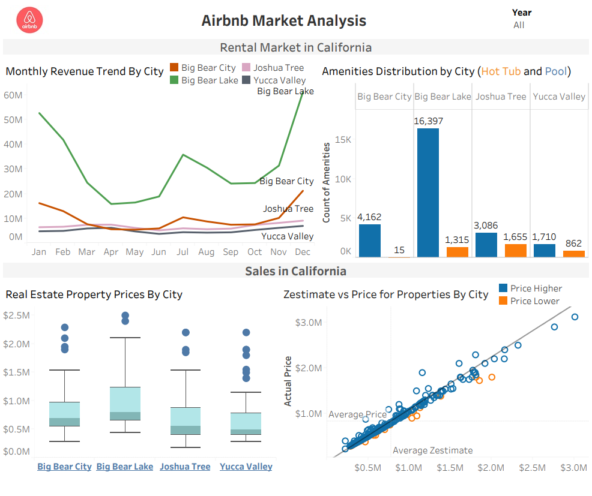

# Airbnb Market and Real Estate Sales Data Visualization

The project aims to provide insights into rental revenue trends, property prices, occupancy ratios, and amenities distribution to help real estate investors, property managers, city planners, and community stakeholders make informed decisions. The project consists of two phases:
* Phase One: Selection and cleaning of the dataset, and formulation of research questions.
* Phase Two: Creation of a project context, a 3-minute story, a big idea, storyboarding, four data visualization charts, and an interactive dashboard in Tableau.

## Dataset Source
The dataset includes monthly aggregated data from 2020 to 2022, detailing revenue, occupancy ratios, nightly rates, amenities, and property sales.
URL: https://www.kaggle.com/datasets/computingvictor/zillow-market-analysis-and-real-estate-sales-data?resource=download
 * amenities.csv: Contains data on amenities available in Airbnb listings.
 * geolocation.csv: Contains latitude and longitude coordinates of Airbnb listings.
 * market_analysis.csv: Aggregated monthly data on listing-level statistics.
 * sales_properties_92252.csv: Sales data for properties in the 92252 zip code.
 * sales_properties_92284.csv: Sales data for properties in the 92284 zip code.
 * sales_properties_92314.csv: Sales data for properties in the 92314 zip code.
 * sales_properties_92315.csv: Sales data for properties in the 92315 zip code.
 * sales_properties_pool_92252.csv: Sales data for properties with pools in the 92252 zip code.
 * sales_properties_pool_92284.csv: Sales data for properties with pools in the 92284 zip code.

## Files
 * Cleaned Dataset.xlsx - CSV files converted to and cleaned using Excel.
 * Airbnb Market Analysis and Real Estate Sales Data - Four charts and Interactive Dashboard using Tableau.
 * Airbnb Market and Real Estate Analysis Report - Detailed Description of Phase one and two.
 * Dashboard - 

## Install Tableau Desktop
1. Visit the Tableau Desktop download page and click on the "TRY NOW" button.
2. Enter your email address and click "DOWNLOAD FREE TRIAL" to start the download.
3. Run the Installer:
 * Once the download is complete, open the .exe file.
 * Accept the terms and conditions and click "Install".
4. Complete Installation:
 * Follow the prompts to complete the installation.
 * After installation, open Tableau Desktop and activate it using your license details or start a trial.